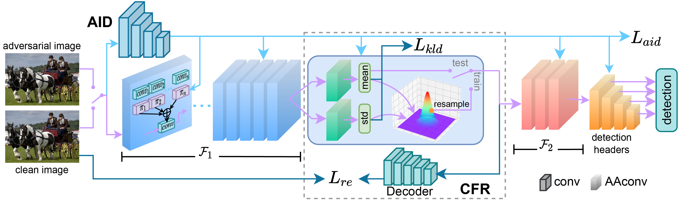

# Adversarially-Aware Robust Object Detector (RobustDet)



## Introduction
This repo is the official PyTorch implementation of **ECCV2022 oral paper** "Adversarially-Aware Robust Object Detector".

RobustDet is an approach to improve the adversarial robustness of CNN-based object detectors.
It aims to defends adversarial attacks specifically for object detectors.
For more details, please refer to our paper.

## Usage

### Requirements
* Python 3.9
* PyTorch >= 1.8
* numpy
* cv2

```bash
pip install -r requirements.txt  # install requirements
```

### Data Preparation
Download the PASCAL VOC and MS-COCO dataset and unpack them. The data structure should look like this

**VOC**
```
VOCdevkit
|-- VOC2007
|      |-- Annotations
|      |-- ImageSets
|      |-- JPEGImages
|-- VOC2012
       |-- Annotations
       |-- ImageSets
       |-- JPEGImages
```

**COCO**
```
coco2017
|-- 2017_clean  # merge train2017 and val2017
|-- annotations
       |-- instances_train2017.json
       |-- instances_val2017.json
```

### RobustDet
We provide codes to reproduce the results in our paper.

#### Training
Download [pretrained backbone and clean models](https://1drv.ms/u/s!Agabh9imkP8qhV1q_x0SxTG17lPU?e=xOcV75), and put them into```weights/``` before training.

To train RobustDet model on VOC dataset:
```bash
python train_robust.py --cfg cfgs/RobustDet_voc.yaml --adv_type mtd --data_use clean --multi_gpu False \
    --basenet weights/ssd300_mAP_77.43_v2.pth --dataset_root <path_to_your_VOC_root>
```

Training on COCO dataset:
```bash
python train_robust.py --cfg cfgs/RobustDet_coco.yaml --adv_type mtd --data_use clean --multi_gpu False \
    --basenet weights/ssd300_COCO_clean_final_300000.pth --dataset_root <path_to_your_COCO_root>
```

#### Evaluation
VOC
```bash
python eval_attack.py --cfg cfgs/RobustDet_voc.yaml --trained_model <path_to_your_trained_model> \
    --data_use clean --adv_type cls \ # attack type, choice in [clean, cls, loc, cwat, dag]
     --dataset_root <path_to_your_VOC_root>
```

COCO
```bash
python eval_attack.py --cfg cfgs/RobustDet_coco.yaml --trained_model <path_to_your_trained_model> \
    --data_use clean --adv_type cls \ # attack type, choice in [clean, cls, loc, cwat, dag]
     --dataset_root <path_to_your_COCO_root>
```

### Baseline Methods (MTD and CWAT)
Our baseline method "Towards Adversarially Robust Object Detection"(MTD) and "Class-Aware Robust Adversarial Training for Object Detection github"(CWAT) both not provide source code.

But in this repo we provide the code that we reproduced.

#### Training
MTD
```bash
python train_adv.py --cfg cfgs/MTD_voc.yaml --adv_type mtd --data_use clean --multi_gpu False \
    --dataset_root <path_to_your_VOC_root>
```

CWAT
```bash
python train_adv.py --cfg cfgs/MTD_voc.yaml --adv_type cwat --data_use clean --multi_gpu False \
    --dataset_root <path_to_your_VOC_root>
```

#### Evaluation
```bash
python eval_attack.py --cfg cfgs/MTD_voc.yaml --trained_model <path_to_your_trained_model> --data_use clean --adv_type cls
```


## Pretrained Models

* [RobustDet VOC](https://1drv.ms/u/s!Agabh9imkP8qhVtbQv1rOa1wPuS8?e=42dGku)
* [RobustDet-VOC + CFR](https://1drv.ms/u/s!Agabh9imkP8qhVypBJ-KHK_s44BT?e=VcUf0a)

## Citation
```
@InProceedings{dong2022robustdet,
  author = {Ziyi Dong, Pengxu Wei, Liang Lin},
  title = {Adversarially-Aware Robust Object Detector},
  booktitle = {Proceedings of the European Conference on Computer Vision},
  year = {2022}
}
```